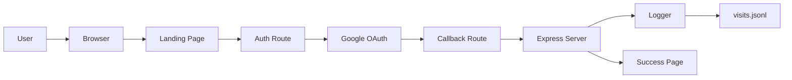
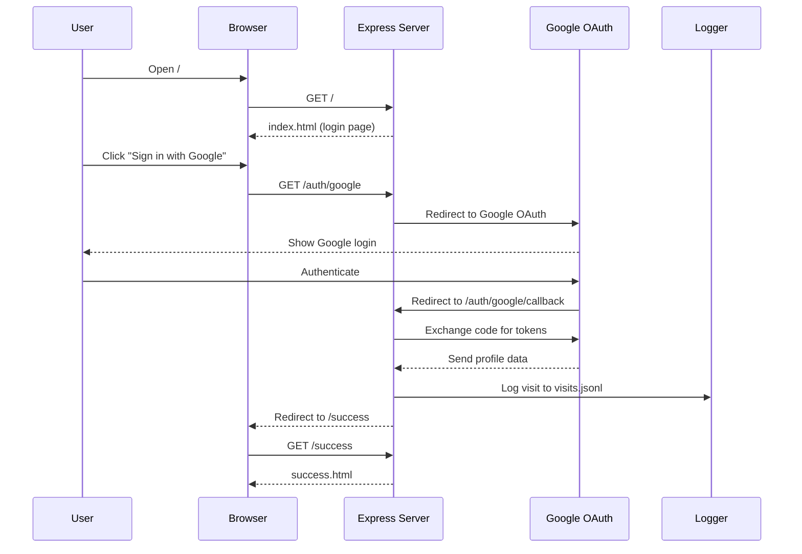

<div align="center">

# 🌟 Web Visitor Tracker 🌟  
### Node.js + Express + Google OAuth 2.0

### *Track Every Visitor with Style and Sophistication*  

This is a modern Node.js + Express application. It serves as a secure, anime-themed template for:

- Google OAuth 2.0 authentication  
- Visitor logging with device & basic info  
- A stylish, animated UI

---

[](https://nodejs.org/)
[](https://expressjs.com/)
[](https://developers.google.com/identity/protocols/oauth2)
[](https://opensource.org/licenses/MIT)


**A beautiful, modern web application that tracks visitor logins with an anime-inspired UI and simple analytics.**

[📸 Screenshots](#-screenshots) • [✨ Features](#-features) • [🚀 Quick Start](#-quick-start) • [📖 Documentation](#-documentation)

---

</div>

This application runs a Node.js web server that listens on a defined port (default: `3000`).

---

## 📋 Table of Contents

- [🎯 About](#-about)  
- [📸 Screenshots](#-screenshots)  
- [✨ Features](#-features)  
- [🏗️ Architecture](#️-architecture)  
- [🚀 Quick Start](#-quick-start)  
- [⚙️ Configuration](#️-configuration)  
- [📖 Documentation](#-documentation)  
- [🛠️ Technologies](#️-technologies)  
- [📁 Project Structure](#-project-structure)  
- [🤝 Contributing](#-contributing)  
- [📝 License](#-license)  
- [👨‍💻 Author](#-author)  
- [🙏 Acknowledgments](#-acknowledgments)

---

## 📸 Screenshots

<div align="center">

### 🏠 Landing Page

*Full-screen anime-style background with Google login button.*


---

### 🎉 Success Page

*Celebratory confirmation after successful login.*


</div>

## 🎯 About

<div align="center">

**Web Visitor Tracker** is a Node.js application that combines secure authentication, visitor logging, and an anime-inspired interface.  
Each login is recorded with metadata (timestamp, IP, user agent, etc.) while users experience a visually pleasing UI.

</div>

### 🎪 Perfect For

| Use Case                     | Description                                      |
|-----------------------------|--------------------------------------------------|
| 📊 **Analytics Dashboards** | Track user login patterns                        |
| 🔐 **Auth Systems**         | Secure OAuth-based login implementation          |
| 📈 **Business Insights**    | Basic visitor info for analysis                  |
| 🎓 **Learning Projects**    | Practice full-stack Node.js + OAuth + logging   |
| 🏢 **Portfolio Projects**   | Showcase authentication & tracking in one app    |

---

## ✨ Features

<table>
<tr>
<td width="50%">

### 🔐 Authentication & Security

- Google OAuth 2.0 integration  
- Secure session handling  
- Environment-based configuration  
- Simple, production-style structure  

### 📊 Visitor Analytics (File-based)

- Timestamp tracking  
- IP address logging  
- Device & browser detection  
- User-agent parsing  

</td>
<td width="50%">

### 🎨 User Interface

- Anime-themed backgrounds  
- Smooth CSS3 animations  
- Responsive layout  
- Dark-themed styling  
- Custom success page  

### 📁 Data Management

- JSON Lines storage (`visits.jsonl`)  
- Append-only logging  
- Easy parsing with scripts  
- Ready to evolve into DB-based storage  

</td>
</tr>
</table>

---

## 🏗️ Architecture

### 🔧 System Architecture Overview



### 🔁 Login Flow



### 🔧 Module Breakdown

| Module               | Purpose                        | Key Responsibilities                               |
|----------------------|--------------------------------|----------------------------------------------------|
| `src/app.js`         | Main application entry point   | Server init, middleware, route registration        |
| `src/auth.js`        | OAuth authentication logic     | Google OAuth flow, callback handling               |
| `src/logger.js`      | Visitor data logging           | IP tracking, UA parsing, JSONL persistence         |
| `src/routes/index.js`| Route handlers                 | Landing, auth, success routes                      |

---

## 🚀 Quick Start

### 📋 Prerequisites

- Node.js `v14+`  
- npm (or yarn)  
- Git  
- Google Cloud Console account (for OAuth credentials)

### 🧩 Installation

```bash
# 1. Clone the repository
git clone https://github.com/AshmitThakur23/Web-Visitor-Tracker-.git
cd Web-Visitor-Tracker-

# 2. Install dependencies
npm install
```

### 🔐 Google OAuth 2.0 Setup

1. Go to the [Google Cloud Console](https://console.cloud.google.com/)  
2. Create a new project or select an existing one  
3. Open **APIs & Services → Credentials**  
4. Click **Create Credentials → OAuth client ID**  
5. Configure consent screen if prompted  
6. Choose application type **Web application**  
7. Add an authorized redirect URI:  
   - `http://localhost:3000/auth/google/callback`  
8. Copy your **Client ID** and **Client Secret**

### ⚙️ Create Environment File

Create a `.env` file in the project root:

```env
# Google OAuth 2.0 Credentials
CLIENT_ID=your-google-client-id-here
CLIENT_SECRET=your-google-client-secret-here
REDIRECT_URI=http://localhost:3000/auth/google/callback

# Server Configuration
PORT=3000
```

> Do not commit `.env` to Git.

### 🎨 Add Anime GIF Backgrounds

Place GIFs in `public/`:

```text
public/
  ├── animegif9.gif   # Login page background
  └── animegif8.gif   # Success page background
```

Recommendation:

- Format: GIF  
- Resolution: 1920×1080 or higher  
- Size: under ~10 MB for performance  

### ▶️ Run the Application

**Development mode** (auto-restart):

```bash
npm run dev
```

**Production mode**:

```bash
npm start
```

Open `http://localhost:3000` in your browser.

---

## ⚙️ Configuration

### Environment Variables

| Variable         | Required | Default | Description                    |
|-----------------|----------|---------|--------------------------------|
| `CLIENT_ID`     | Yes      | –       | Google OAuth 2.0 Client ID    |
| `CLIENT_SECRET` | Yes      | –       | Google OAuth 2.0 Client Secret|
| `REDIRECT_URI`  | Yes      | –       | OAuth callback URL            |
| `PORT`          | No       | `3000`  | Server port                   |

### Customization

#### Background GIFs

```text
public/
  ├── animegif9.gif  # Login page
  └── animegif8.gif  # Success page
```

#### Styling

Edit `public/style.css` to change:

- Colors and gradients  
- Fonts and typography  
- Animations and transitions  
- Layout and spacing  

#### Text Content

Edit templates in `src/views/`:

- `index.html` – login page  
- `success.html` – success page  

---

## 📖 Documentation

### 🎮 Usage

#### Start the Server

```bash
npm run dev    # development
npm start      # production
```

#### Visitor Logs

Visitor data is stored in `logs/visits.jsonl`:

```json
{
  "timestamp": "2025-11-02T15:30:45.123Z",
  "ip": "192.168.1.100",
  "userAgent": "Mozilla/5.0 (Windows NT 10.0; Win64; x64)...",
  "browser": "Chrome",
  "browserVersion": "119.0.0.0",
  "os": "Windows",
  "osVersion": "10",
  "device": "Desktop"
}
```

#### Processing Logs

**Count total visitors:**

```javascript
const fs = require('fs');

const logs = fs.readFileSync('logs/visits.jsonl', 'utf-8')
  .split('\n')
  .filter(line => line.trim())
  .map(line => JSON.parse(line));

console.log(`Total visitors: ${logs.length}`);
```

**Analyze browser usage:**

```javascript
const browserStats = logs.reduce((acc, log) => {
  acc[log.browser] = (acc[log.browser] || 0) + 1;
  return acc;
}, {});

console.log('Browser Statistics:', browserStats);
```

### 🔌 API Endpoints

| Method | Endpoint                 | Description                        |
|--------|--------------------------|------------------------------------|
| `GET`  | `/`                      | Landing page with login button     |
| `GET`  | `/auth/google`          | Initiates Google OAuth flow        |
| `GET`  | `/auth/google/callback` | OAuth callback handler             |
| `GET`  | `/success`              | Success page after login           |

---

## 🛠️ Technologies

<div align="center">

### Backend

[](https://nodejs.org/)
[](https://expressjs.com/)
[](https://oauth.net/2/)

### Frontend

[](https://developer.mozilla.org/en-US/docs/Web/HTML)
[](https://developer.mozilla.org/en-US/docs/Web/CSS)
[](https://developer.mozilla.org/en-US/docs/Web/JavaScript)

### Tooling

[](https://code.visualstudio.com/)
[](https://git-scm.com/)
[](https://www.npmjs.com/)

</div>

### Core Dependencies

```json
{
  "express": "^4.18.2",
  "dotenv": "^16.0.3",
  "ua-parser-js": "^1.0.35",
  "nodemon": "^2.0.22"
}
```

---

## 📁 Project Structure

```text
Web-Visitor-Tracker/
│
├── src/
│   ├── app.js                # Main application entry
│   ├── auth.js               # OAuth 2.0 logic
│   ├── logger.js             # Visitor logging
│   ├── routes/
│   │   └── index.js          # Route handlers
│   └── views/
│       ├── index.html        # Login page
│       └── success.html      # Success page
│
├── public/
│   ├── style.css             # Global styles & animations
│   ├── animegif9.gif         # Login background
│   └── animegif8.gif         # Success background
│
├── logs/
│   └── visits.jsonl          # Visitor logs (JSONL)
│
├── .env                      # Environment variables (local)
├── .gitignore
├── package.json
├── package-lock.json
└── README.md
```

---

## 🤝 Contributing

Contributions are welcome!

1. Fork the repository  
2. Clone your fork  
3. Create a feature branch  
4. Make and test your changes  
5. Commit with a clear message  
6. Push and open a Pull Request  

### Ideas

- New themes and UI polish  
- Analytics dashboard with charts  
- Database integration (MongoDB, PostgreSQL, etc.)  
- Real-time notifications or webhooks  
- Internationalization (i18n)  
- Automated tests and CI workflows  

---

## 📝 License

This project is licensed under the **MIT License**.  
See the [LICENSE](LICENSE) file for details.

---

## 👨‍💻 Author

<div align="center">

### Ashmit Thakur

[](https://github.com/AshmitThakur23)
[](https://github.com/AshmitThakur23/Web-Visitor-Tracker-)

**Full-Stack Developer • Node.js Enthusiast • Open Source Contributor**

</div>

---

## 🙏 Acknowledgments

<div align="center">

| Technology | Purpose |
|------------|---------|
| Google OAuth 2.0 | Secure, seamless authentication |
| ua-parser-js | User agent parsing |
| Express.js | Minimal, fast web framework |
| Node.js | JavaScript runtime environment |
| Anime community | Visual and aesthetic inspiration |
| Open source community | Continuous learning and support |

---

## 🌟 Show Your Support

If this project helped you:

⭐ Star this repository  
🍴 Fork it for your own projects  
🐛 Report bugs and suggest improvements  

---

### Made with ❤️, caffeine, and anime inspiration.


</div>
